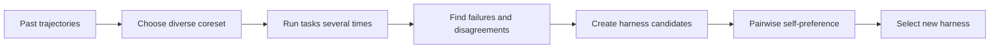

## Main idea
RHO improves a harness from old agent runs even when there are no correct-answer labels. It selects useful past tasks, runs them again, studies failure patterns, creates harness changes, and uses the agent itself to compare candidates.

## Key concepts
- **Trajectory:** The full record of one agent run. It includes model messages, tool calls, observations, and the final result.
- **Coreset:** A small set of tasks that represents a larger set.
- **DPP:** A selection method that prefers a diverse set instead of many similar items.
- **Self-consistency:** If repeated attempts disagree, the task or behavior is unstable.
- **Pairwise preference:** The evaluator compares two candidates directly and chooses the better one.

## Optimization loop

## How it works in the paper
1. RHO selected a small and diverse group of past tasks from the deployment history. The paper used a **determinantal point process (DPP)** for this step. A DPP prefers a set whose members are different from each other, so the coreset did not spend most of its budget on near-duplicate failures.
2. Each selected task was solved **G times in parallel**. These repeated runs created a new signal. If the runs disagreed, the behavior was unstable. If they failed in the same way, the failure looked systematic.
3. The diagnosis combined **self-validation** inside one trace with **self-consistency** across the G traces. Self-validation looked for internal signs of failure. Self-consistency used disagreement between attempts as evidence that the current harness was unreliable on that case.
4. The diagnosis then conditioned the generation of **N candidate harness updates**. The editable surface included prompts, program parameters, workflow code, skills, tools, and memory. The candidate was therefore a whole-harness change, not a local component patch.
5. The optimization step did not use a labeled validation answer key. The method relied on the internal diagnostic signals and the model's own comparisons.
6. Candidate harnesses were compared with **pairwise self-preference**. The model judged which rollout looked better. The preferred candidate was selected. This makes the preference model the main selection mechanism.

RHO can change prompts, tools, skills, memory, and workflow code.

## Why it matters for RHEvolution
RHO gives RHEvolution a useful way to learn from **unlabeled history**. This can reduce dependence on a fixed validation set.

However, RHO still treats the harness as one large object. It does not assign separate budgets to components. It also does not split a component when its failures are too broad. RHEvolution can use RHO-style diagnosis and preference while changing the search unit from “whole harness” to “adaptive component.”

## Exact reported results
- SWE-Bench Pro pass rate after one optimization round: **59% → 78%** with no external grading during the optimization round.
- The paper reports gains across **software engineering, technical work, and knowledge work**.
- Analysis showed that the evolved harness created targeted tools and skills for recurring failure modes instead of only storing more memory.
- The evolved harness also changed long-horizon action patterns.
- Ablations showed that the diagnostic stages added useful signal beyond simple experience accumulation.

## What the results mean
The result shows that past behavior can be turned into an optimization signal even when a clean labeled development set is not available. The key information came from diversity, repeated execution, and disagreement. The weak point is that the model also judges its own candidates, so the selection signal can be biased.

## Evidence and limits
- The paper reports a large one-round gain on SWE-Bench Pro without external grading.
- It also reports gains in software, technical, and knowledge-work tasks.
- Self-preference can be biased. The same model can prefer fluent but wrong behavior.
- The paper mainly studies one optimization round. Repeated self-preference can accumulate error.
