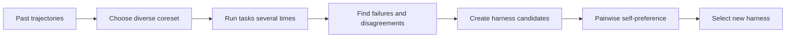

## Main idea
RHO improves a harness from old agent runs even when there are no correct-answer labels. It selects useful past tasks, runs them again, studies failure patterns, creates harness changes, and uses the agent itself to compare candidates.

## Key concepts
- **Trajectory:** The full record of one agent run. It includes model messages, tool calls, observations, and the final result.
- **Coreset:** A small set of tasks that represents a larger set.
- **DPP:** A selection method that prefers a diverse set instead of many similar items.
- **Self-consistency:** If repeated attempts disagree, the task or behavior is unstable.
- **Pairwise preference:** The evaluator compares two candidates directly and chooses the better one.

## Optimization loop

## How it works
1. RHO selects a small and diverse group of past tasks.
2. It solves each selected task several times.
3. It looks for clear failures and for disagreement between repeated attempts.
4. It uses this evidence to propose full-harness changes.
5. There is no external answer key during optimization.
6. The agent compares candidate rollouts and chooses the preferred harness.

RHO can change prompts, tools, skills, memory, and workflow code.

## Why it matters for RHEvolution
RHO gives RHEvolution a useful way to learn from **unlabeled history**. This can reduce dependence on a fixed validation set.

However, RHO still treats the harness as one large object. It does not assign separate budgets to components. It also does not split a component when its failures are too broad. RHEvolution can use RHO-style diagnosis and preference while changing the search unit from “whole harness” to “adaptive component.”

## Evidence and limits
- The paper reports a large one-round gain on SWE-Bench Pro without external grading.
- It also reports gains in software, technical, and knowledge-work tasks.
- Self-preference can be biased. The same model can prefer fluent but wrong behavior.
- The paper mainly studies one optimization round. Repeated self-preference can accumulate error.
