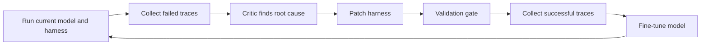

## Main idea
Co-Harness improves the harness and the model in alternating steps. A critic studies failed trajectories and patches the harness. The improved harness then creates better successful trajectories, and those trajectories are used to fine-tune the model.

## Key concepts
- **Root-cause attribution:** Decide what actually caused a failure.
- **Harness dimension:** One part of the harness, such as prompts, tools, skills, middleware, or memory.
- **Validation gate:** A rule that accepts a change only after tests show that it helps and does not cause a measured regression.
- **SFT:** Supervised fine-tuning. The model learns to imitate successful trajectories.

## Optimization loop

## How it works
1. The current model runs with the current harness.
2. A HarnessCritic reads failed traces.
3. The critic assigns each failure to a fixed harness category or to the model itself.
4. It proposes a small code or configuration change.
5. The system re-runs tasks. A patch is accepted only if it fixes the target failure without a measured regression.
6. Successful traces from the improved harness become SFT data.
7. The new model can expose new harness bottlenecks, so the cycle repeats.

## Why it matters for RHEvolution
Co-Harness shows that **failure attribution plus rollback** can make self-improvement much safer. RHEvolution should copy this discipline.

The limitation is structural. Co-Harness has a fixed five-part decomposition. The critic can choose which part to patch, but it cannot invent a new part or split one part into smaller units. RHEvolution can treat the decomposition itself as an object that changes.

## Detailed process reported in the paper
The paper represented the harness as five fixed parts: **prompts/templates, tools, skills, middleware, and long-term memory**.

For each failed trajectory, HarnessCritic produced a structured diagnosis. The record included the root cause, the harness area involved, severity, supporting evidence, and a proposed change.

The fixed failure classes were:
- prompt ambiguity,
- tool schema error,
- missing skill,
- middleware mismatch,
- memory overflow,
- agent error.

The **agent error** class acted as an abstention label. A failure assigned to that class did not trigger a harness patch.

The paper ranked repeated diagnoses by recurrence, severity, and consistency of the reported location. The selected repair became a local configuration or code diff.

Candidate changes were then re-run on held-out task splits. The acceptance rule required improvement on the targeted failure region and no measured regression outside that region. Accepted versions were stored in a versioned harness registry, which also supported rollback.

The paper then used successful trajectories from the improved configuration for a separate model-alignment stage. The important conceptual point is that the harness and the model were improved in alternating rounds rather than assuming one side stayed permanently fixed.

## Exact reported results
- Main average accuracy across the reported rounds: **58.5% → 73.5% → 78.9%**.
- Total gain over the starting baseline: **+20.4 percentage points**.
- Reported gain over a human-designed static harness: **+24.7 points**.
- HMMT25 with the 32B model: **49.8% → 77.0%**, a **+27.2 point** gain.
- HMMT25 with the 8B model: reported **+20.1 points**.
- A 200+ hour autonomous case study produced **22 harness versions**.
- One engineering-repair phase moved a failing configuration from **0% to 59.6%**.
- A later batching change reduced one runtime from **3.78 hours to 1.11 hours** while restoring accuracy to about **61.5%**.
- A six-trajectory majority-vote ensemble reached **63.3%** within a **3.33 hour** budget.
- The version registry rolled back a prompt change that caused about a **16.5 point** regression.
- AIME25 with the 8B model improved from **56.9% to 78.3%** after the model-alignment stage.

## Failure modes reported by the paper
- **Model-side plateau:** later improvement can be limited by the model rather than the harness.
- **Over-patching:** added harness complexity can hurt a weaker model.
- **Attribution cascade:** one repair can introduce a new bug.
- **Counterfactual difficulty:** attribution becomes harder when the correct diagnosis depends on an alternative execution path that was never taken.

The paper reports human annotation agreement of **κ = 0.77** on 200 trajectories for the failure taxonomy. It does not report a direct HarnessCritic-vs-human attribution accuracy.

## Evidence and limits
- The paper reports large gains across two co-evolution rounds on tool-integrated math tasks.
- It also reports automatic rollback when a prompt change caused a large regression.
- The strongest evidence comes from one narrow task family.
- The system needs a capable critic and extra compute for repeated evaluation and fine-tuning.
