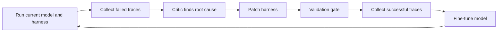

## Main idea
Co-Harness improves the harness and the model in alternating steps. A critic studies failed trajectories and patches the harness. The improved harness then creates better successful trajectories, and those trajectories are used to fine-tune the model.

## Key concepts
- **Root-cause attribution:** Decide what actually caused a failure.
- **Harness dimension:** One part of the harness, such as prompts, tools, skills, middleware, or memory.
- **Validation gate:** A rule that accepts a change only after tests show that it helps and does not cause a measured regression.
- **SFT:** Supervised fine-tuning. The model learns to imitate successful trajectories.

## Optimization loop

## How it works
1. The current model runs with the current harness.
2. A HarnessCritic reads failed traces.
3. The critic assigns each failure to a fixed harness category or to the model itself.
4. It proposes a small code or configuration change.
5. The system re-runs tasks. A patch is accepted only if it fixes the target failure without a measured regression.
6. Successful traces from the improved harness become SFT data.
7. The new model can expose new harness bottlenecks, so the cycle repeats.

## Why it matters for RHEvolution
Co-Harness shows that **failure attribution plus rollback** can make self-improvement much safer. RHEvolution should copy this discipline.

The limitation is structural. Co-Harness has a fixed five-part decomposition. The critic can choose which part to patch, but it cannot invent a new part or split one part into smaller units. RHEvolution can treat the decomposition itself as an object that changes.

## Evidence and limits
- The paper reports large gains across two co-evolution rounds on tool-integrated math tasks.
- It also reports automatic rollback when a prompt change caused a large regression.
- The strongest evidence comes from one narrow task family.
- The system needs a capable critic and extra compute for repeated evaluation and fine-tuning.
