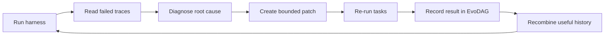

## Main idea
AutoSaddler reads failed execution traces, finds a likely root cause, makes a limited harness patch, and keeps a history of what worked. It uses that history to combine useful changes from different earlier harnesses.

## Key concepts
- **Execution trace:** A detailed record of what the agent did and what the environment returned.
- **Patch:** A small change to harness code or instructions.
- **EvoDAG:** A directed acyclic graph that stores harness versions and the changes between them.
- **Durable update:** A change that helps more than the one task that caused it.

## Optimization loop

## How it works
1. The harness runs on a small batch of training tasks.
2. A diagnosis agent reads the failed traces and relevant harness source code.
3. It chooses a patch from a fixed set of prompt, tool, or middleware change types.
4. The patched harness is re-tested on the batch.
5. The system records what became fixed, what regressed, and what still fails.
6. EvoDAG stores this history.
7. A later evolution step can combine useful changes from different earlier versions.
8. A development set chooses the final candidate.

## Why it matters for RHEvolution
AutoSaddler is useful because it treats **traces as credit-assignment evidence** and keeps an explicit history of changes. RHEvolution can use the same idea for split and fuse decisions.

The main gap is that the search structure is fixed. AutoSaddler can choose among known patch types, but it does not discover new component boundaries. Its DAG stores versions of whole harnesses, not a changing decomposition of the harness.

## Evidence and limits
- The paper reports gains on GAIA2, SWE-Bench Pro, and Terminal-Bench 2.0.
- It uses fewer traces than several earlier harness optimizers in the reported comparisons.
- The patch taxonomy is human-designed.
- If the diagnosis is wrong, the search can spend many evaluations on the wrong part.
