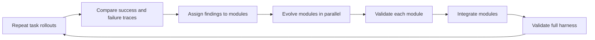

## Main idea
ModularRSI splits a harness into five functional modules, studies success and failure traces to assign blame, improves the modules separately, and then integrates them. In its ablation, modular evolution works while whole-harness evolution becomes worse than the starting harness.

## Key concepts
- **Contrastive trace:** Two runs of the same task where one succeeds and one fails.
- **Credit assignment:** Decide which function or module most likely caused the difference.
- **Module-wise evolution:** Change one functional part without freely editing the rest.
- **Evolution history:** A record of past changes and results for a function.
- **Integration epoch:** A final stage that resolves conflicts between independently improved modules.

## Optimization loop

## How it works
The harness is divided into five modules: agent loop, observation management, tool use, context management, and task-completion detection.

For each task, the system runs several attempts. Mixed success and failure runs are especially useful because the task is the same and the behavior differs. The optimizer turns these comparisons into function-level findings. Each module then evolves inside a restricted scope. Program checks, anti-hack checks, and execution tests reject bad changes. Finally, an integration stage resolves conflicts between modules.

## Why it matters for RHEvolution
This is one of the strongest direct precedents for RHEvolution. It shows that **decomposition can improve credit assignment and generalization**. It also shows that integration is not optional.

The open question is exactly RHEvolution's question: why five modules? The authors choose those boundaries. RHEvolution should test whether an agent can discover a better decomposition, split a module when evidence is mixed, and fuse modules when their changes are too coupled.

## Evidence and limits
- Modular evolution improves the reported Terminal-Bench result.
- Joint all-module evolution and non-modular whole-harness evolution both fall below the starting baseline in the key ablation.
- The evolved harness also transfers across benchmarks and model families.
- The five-module structure is asserted by the designers rather than learned.
