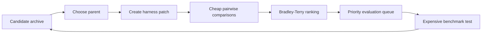

## Main idea
SIFT reduces the cost of recursive agent search. It uses cheap pairwise LLM judgments to rank many candidate harnesses, then spends expensive benchmark evaluations only on the most promising candidates.

## Key concepts
- **Tree search:** Candidate harnesses form nodes. A new edit creates a child node.
- **Pairwise judge:** An evaluator compares two candidates directly.
- **Bradley-Terry model:** A statistical model that converts many pairwise wins and losses into one strength score per candidate.
- **Expansion:** Create a new candidate.
- **Evaluation:** Run a candidate on expensive benchmark tasks.
- **Disaggregated search:** Expansion and evaluation can run as separate work streams.

## Optimization loop

## How it works
1. Search keeps an archive of harness versions.
2. A parent is chosen with a mix of quality and exploration pressure.
3. The optimizer creates a child patch.
4. A judge compares the child with existing candidates.
5. Pairwise results update a global strength estimate.
6. High-potential candidates enter a priority queue for full evaluation.
7. Expansion can continue while slow evaluations are still running.

## Why it matters for RHEvolution
RHEvolution needs separate budgets for many components. Full-harness evaluation after every local edit would be too expensive.

SIFT gives a practical two-level solution. Use a cheap ranking signal to decide which component edits deserve expensive global rollouts. Then reserve full validation for the small set of changes that might alter the decomposition.

The warning is that one scalar score can hide task-specific tradeoffs. RHEvolution may need component- or failure-conditioned rankings.

## Evidence and limits
- The paper reports similar or better results than DGM and HGM on Polyglot with much lower search cost.
- Repeated runs remain above the DGM baseline in the reported study.
- Final validation still needs real benchmark execution.
- Strong runs use a judge that is larger than the coding model.
