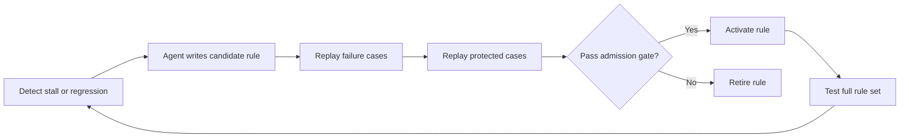

## Main idea
This paper treats self-modification as an admission-control problem. The agent can propose a new behavioral rule, but the rule becomes permanent only after evidence shows that it helps a failure case and does not damage protected cases.

## Key concepts
- **Candidate rule:** A new instruction or behavior change that is not permanent yet.
- **Protected case:** A case that already works and must not regress.
- **Replay:** Run a saved case again under the candidate rule.
- **Admission gate:** The test that decides whether a candidate rule becomes active.
- **Corpus guard:** A later test of the full set of active rules, because individually good rules can interfere.

## Optimization loop

## How it works
1. An evaluator watches the agent and detects a stall or regression.
2. The agent reads the flagged trace and proposes a repair rule.
3. The rule gets temporary authority.
4. The system replays a few matched failure cases and a few prior success cases.
5. The rule is accepted only if it improves a target failure and stays within the allowed regression margin.
6. The system also checks the full active rule set because separate rules can conflict.

## Why it matters for RHEvolution
This is a strong warning for component evolution: **local improvement is not enough**. A component can look better by itself and still damage the full system.

RHEvolution should therefore keep two gates. One gate tests the component. A second gate tests the fused harness. If these disagree, the system should revert or change the decomposition.

## Evidence and limits
- About 46% of proposed rules were rejected in the reported study.
- Many rejected rules improved their target failure but damaged a protected case. This directly shows local/global conflict.
- Protected-case coverage is small, so the gate cannot prove global safety.
- The method adds substantial cost and latency because validation needs replay.
