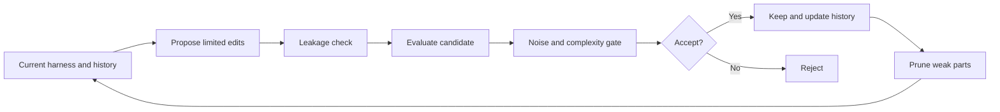

## Main idea
RRSI adds regularization to harness evolution. The goal is to stop the optimizer from winning on its training tasks by adding fragile, noisy, or unnecessary changes.

## Key concepts
- **Regularization:** A constraint that makes an optimizer prefer simpler or more general solutions.
- **Edit budget:** A limit on how much the harness can change in one round.
- **Leakage:** Logic that uses benchmark-specific details instead of a reusable mechanism.
- **Noise band:** The normal score variation when nothing important changed.
- **Structural pruning:** Remove parts that do not show useful contribution.

## Optimization loop

## How it works
RRSI regularizes both proposal and selection.

1. Early rounds can make larger edits. Later rounds use a smaller edit budget.
2. The proposer sees past accepted and rejected hypotheses, so it does not repeat the same failed idea.
3. When progress stalls, some search budget moves to parts that have not been explored.
4. A leakage critic rejects benchmark-specific tricks.
5. A candidate must beat normal evaluation noise.
6. Extra complexity must be justified by enough score gain.
7. Parts with no recent positive contribution become pruning targets.

## Why it matters for RHEvolution
RHEvolution can use these controls to stop recursive splitting from becoming uncontrolled growth. A split should have a cost. A new component should remain only when it adds clear value. Old components should be removable.

RRSI still uses a fixed component list. It reallocates attention across that list, but it does not change the list itself. RHEvolution can extend the idea by regularizing **the decomposition structure**.

## Evidence and limits
- The paper reports better out-of-distribution behavior than several unregularized evolution baselines.
- It also reports lower policy-token use.
- The L0/L1/L2 analogy is conceptual, not one unified mathematical objective.
- Several thresholds and schedules still need manual tuning.
