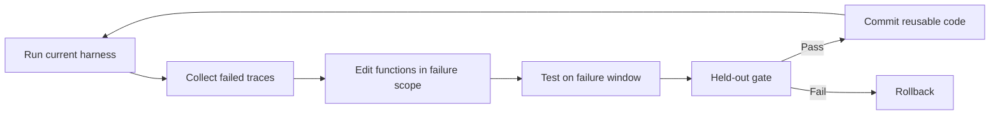

## Main idea
Growing Harness starts with almost no control strategy. An offline optimizer watches failures and turns repeated control decisions into executable harness code. The deployed model then spends less time rebuilding the same strategy inside its context.

## Key concepts
- **Strategy-free scaffold:** A minimal agent loop with model and tool access, but almost no task strategy.
- **Execution DAG:** A graph of which functions, model calls, and tool calls happened during one run.
- **Trace-local edit:** A change limited to code that was actually involved in the failure.
- **Gate set:** Held-out tasks used to stop a repair from damaging earlier behavior.
- **Rollback:** Restore the last accepted harness when a candidate fails the gate.

## Optimization loop

## How it works
1. The system runs a minimal harness on a stream of tasks.
2. Failed runs enter a bounded failure window.
3. A stronger offline optimizer reads the harness code and the execution DAG.
4. It can edit functions that were active in the failure and can add helper functions.
5. The candidate must repair several failures, not only one.
6. A held-out success gate checks for regression.
7. Accepted behavior becomes normal executable code in the shared harness.

The optimizer is encouraged to put deterministic work into code and keep fuzzy semantic work in the LLM.

## Why it matters for RHEvolution
This paper is unusually close to **emergent structure**. The harness can grow new helper functions and specialized handlers from failure evidence. That is stronger than choosing from a fixed plugin list.

However, the system does not have explicit split and fuse operators. It also uses one shared repair process instead of giving discovered components separate search budgets. RHEvolution can make the structural change itself explicit.

## Evidence and limits
- The paper reports large reductions in deployed LLM calls and inference cost.
- Smaller deployment models benefit strongly from the learned harness.
- A held-out gate prevents some harmful growth.
- The optimizer is a stronger external model, so this is not fully self-contained recursive improvement.
