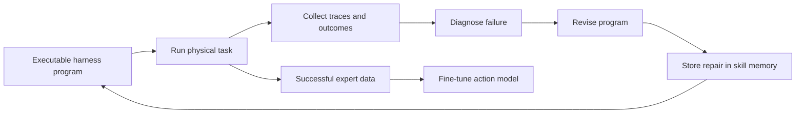

## Main idea
HarnessPAI turns a physical-agent harness into executable code. The code controls perception, reasoning, action-model calls, and verification. After each rollout, the system studies failures, revises the program, and stores reusable repair knowledge.

## Key concepts
- **Action model:** A model that converts observations into robot actions.
- **Open-loop rollout:** The high-level program is fixed before execution and runs without new high-level LLM planning at every step.
- **Closed-loop evolution:** The program changes between rollouts based on observed results.
- **Skill memory:** A reusable store of failure-to-repair knowledge.

## Optimization loop

## How it works
1. A high-level program defines task decomposition, perception calls, geometric reasoning, action-model calls, and success checks.
2. The program runs end to end.
3. The system records failures and physical outcomes.
4. An agent edits the program after the rollout.
5. Repair knowledge enters a graph-structured skill memory.
6. Successful runs can also become training data for the action model.

## Why it matters for RHEvolution
HarnessPAI shows how **executable structure plus reusable repair memory** can improve a system without changing the action model during each search step.

Its weak point is credit assignment. The whole program is still revised as one main object. RHEvolution can split the program into independently tested components when a long program produces ambiguous failures.

## Evidence and limits
- The paper reports large gains on LIBERO-PRO and RoboCasa tasks.
- Successful harness trajectories also improve the wrapped action model after fine-tuning.
- The method assumes the base action model can perform the needed low-level behavior.
- Whole-program evolution can become hard as the number of coupled stages grows.
