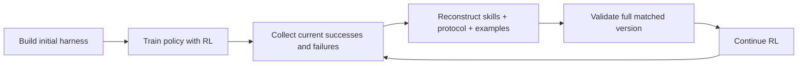

## Main idea
RLHarness alternates between reinforcement learning and harness reconstruction. It does not update one skill in isolation. It updates the skill bank, the skill-use protocol, and the examples together so these parts stay consistent with each other and with the current policy.

## Key concepts
- **Skill bank:** A set of reusable procedures.
- **Invocation protocol:** Rules for when and how the model should use a skill.
- **Few-shot examples:** Demonstrations that show the expected procedure.
- **Atomic update:** Several linked parts change together as one version.
- **Policy boundary:** The tasks the current model can or cannot solve reliably.

## Optimization loop

## How it works
1. The system builds an initial skill bank, protocol, and example set.
2. RL improves the policy while the harness is fixed.
3. New traces show what the improved policy now finds easy or difficult.
4. The system compares matched successes and failures.
5. It removes weak skills and changes skill triggers and order.
6. It rewrites the examples so they match the new skill structure.
7. The full set is committed as one version.
8. RL continues from the existing checkpoint.

## Why it matters for RHEvolution
This paper gives an important counterargument to independent component evolution. Some components are **coupled**. If RHEvolution changes a skill but leaves its protocol and examples unchanged, the full harness can become inconsistent.

RHEvolution therefore needs dependency-aware groups. Some nodes can evolve alone. Other tightly coupled nodes should be fused and tested as one unit. A split operation must preserve interface and version consistency.

## Evidence and limits
- The paper reports its best results only after reconstruction and a second RL stage.
- Updating the harness without policy adaptation does not always help.
- The task set is narrow and includes internal data.
- Reconstruction uses a strong teacher model, which increases cost.
