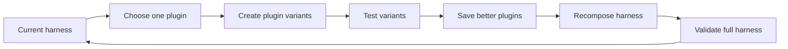

## Main idea
PluginRSI does not rewrite the full harness every time. It splits the harness into reusable plugins. It improves one plugin at a time, saves useful versions, and then builds a new harness from the best plugins.

This is important because a full-harness rewrite can damage a part that already works.

## Key concepts
- **Harness:** The code and instructions around the model. It can include tools, memory, prompts, and control logic.
- **Plugin:** One harness function with a standard input and output interface.
- **Workflow:** The logic that decides when and how the plugins run.
- **Validation task:** A task used to check whether a change is actually better.

## Optimization loop

## How it works
1. The system starts with a workflow and a library of plugins.
2. The optimizer selects one plugin and creates several variants.
3. It tests the variants on small, balanced task batches.
4. Better variants enter the shared plugin library.
5. The optimizer then selects a new plugin set and can revise the workflow.
6. The full harness is tested before the new version is accepted.

The model that solves tasks stays fixed. The proposer also stays fixed. The improvement comes from the harness.

## Why it matters for RHEvolution
This paper gives strong evidence that **component-level evolution can work better than monolithic evolution**. It also gives RHEvolution a useful library idea: keep successful components so future search can reuse them.

The main difference is the decomposition. PluginRSI uses plugin boundaries that humans defined in advance. RHEvolution wants the agent to decide when a component is too large, split it, and later fuse components when that is useful.

## Evidence and limits
- The paper reports stronger held-out results than Meta-Harness on SWE-bench Verified and Terminal-Bench 2.1.
- Reusing the evolved plugin library also helps on new optimization runs.
- The plugin boundaries are fixed. The system cannot decide that one plugin should become two smaller components.
- A failure that crosses several plugin boundaries can still be hard to assign to one component.
