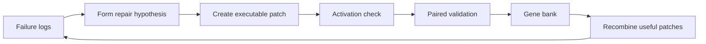

## Main idea
Raven combines two ideas. First, a host agent decomposes user goals into a task DAG for specialist agents. Second, a harness-evolution system turns failure evidence into tested patches and stores useful variants in a quality-diversity gene bank.

## Key concepts
- **Task DAG:** A directed acyclic graph. Each node is a subtask, and edges show which outputs another subtask needs.
- **Activation predicate:** A condition that proves a proposed change actually executed.
- **Paired-gain test:** Compare the candidate and parent on the same tasks.
- **Gene bank:** An archive that keeps strong candidates from different behavior categories.
- **Recombination:** Build a new candidate with useful changes from different lineages.

## Optimization loop

## How it works
At task time, the host agent builds a dependency graph and assigns nodes to specialist agents.

For harness evolution:
1. The evolver reads a failure and links it to trace evidence.
2. It names the editable location and expected behavior change.
3. It creates an executable patch.
4. The system checks that the patch actually activates.
5. It compares the candidate with its parent on matched tasks.
6. Useful candidates enter a gene bank.
7. Later search can combine changes from different archive cells.

## Why it matters for RHEvolution
Raven proves that agents can already do **task decomposition** with DAGs. It also gives a useful archive and recombination design for harness evolution.

However, Raven does not apply the same decomposition logic to the harness itself. Its harness modules and edit categories are fixed. RHEvolution can reuse the task-DAG idea at the meta level: represent the harness as a dependency graph, then let the agent change that graph when credit assignment fails.

## Evidence and limits
- Raven reports strong orchestration results and gains from archived harness evolution.
- The gene bank keeps diverse mechanisms instead of only one winner.
- The harness module taxonomy is still human-designed.
- Archive quality does not guarantee improvement on unseen tasks.
