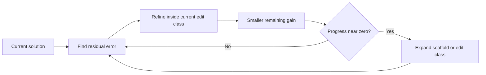

## Main idea
This paper gives a theory for why repeated refinement eventually stops helping. If the system can only make changes from a fixed set, the remaining gains must shrink. To escape that limit, the system must expand what it is able to change.

## Key concepts
- **Residual error:** The part of the problem that the current solution still gets wrong.
- **Reachable edit class:** The set of changes the current system can produce.
- **Stationarity:** A state where more iterations produce almost no useful improvement.
- **Scaffold:** The external system around the model, such as tools, prompts, memory, and orchestration.
- **Uniform edge:** A persistent ability to make progress better than chance or noise.

## Optimization loop

## How it works
The paper models refinement as repeated correction of residual error.

Its main result is simple:
1. Quality is bounded.
2. If each step improves quality, the sum of all future improvements is also bounded.
3. Therefore the gain per step must eventually approach zero.
4. A fixed search space must saturate.
5. If the scaffold changes the set of reachable edits, useful progress can continue for longer.
6. Frozen model weights do not mean the full system is stationary, because the scaffold can still change.

The paper also studies orchestration and voting. More parallel workers can improve search speed, but correlated workers can fail on the same hard cases.

## Why it matters for RHEvolution
This is theoretical support for the main RHEvolution idea. Recursive splitting changes the reachable search space. It can create new components, interfaces, and edit targets when the old decomposition stops producing progress.

But expansion alone is not enough. A larger search space can also create noise. RHEvolution must show that its structural changes produce a reliable improvement signal, not only more possible edits.

## Evidence and limits
- The paper reports diminishing per-round gains in coding-agent experiments.
- It also finds strong failure overlap among similar workers, which limits simple voting.
- The theory gives conditions and ceilings, not a full convergence rate.
- The assumptions still need direct testing in adaptive harness-decomposition systems.
