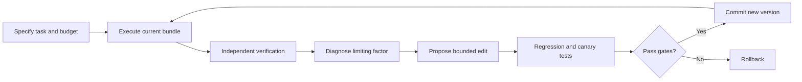

## Main idea
This paper represents physical-agent state and policy as executable code. Because the state, control logic, tools, and checks are explicit, the system can diagnose a failure, edit the responsible artifact, test the change, and roll back when needed.

## Key concepts
- **Code as World:** Program state that represents objects, relations, constraints, and task progress.
- **Code as Policy:** Program logic for planning, tool use, verification, recovery, and action.
- **Artifact bundle:** The versioned set of world state, policy, harness, data, memory, and evaluator.
- **Canary rollout:** A small test run used before wider deployment.
- **Independent evaluator:** A checker that is separate from the model that proposed the change.

## Optimization loop

## How it works
The method uses a seven-step cycle: specify, execute, verify, diagnose, propose, evaluate, and commit.

The important design choice is that failures can be linked to explicit artifacts. A problem can come from the world representation, a tool, a workflow branch, a verifier, or the model. The system changes the implicated artifact instead of retraining everything.

## Why it matters for RHEvolution
This paper gives RHEvolution a strong **versioning and validation discipline**. Every structural change should have a parent version, a clear hypothesis, an independent check, and a rollback path.

The paper still starts from a human-defined set of evolution targets. It does not recursively split a failing target into smaller search units. RHEvolution can make that decomposition dynamic.

## Evidence and limits
- The paper reports harness gains on RoboCasa and large improvements from tool evolution on several physical tasks.
- Successful verified traces can also improve the model through later fine-tuning.
- Full co-evolution of all proposed targets is not demonstrated.
- Real-robot evidence uses few trials, so small differences need caution.
