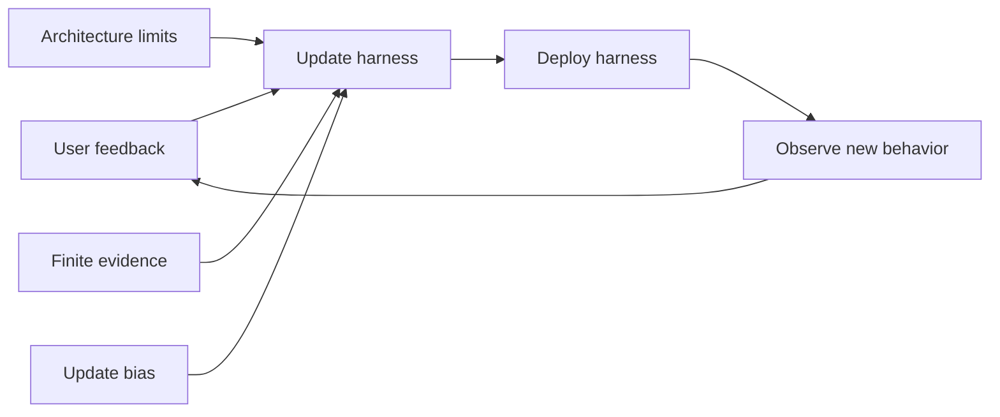

## Main idea
This paper treats harness evolution as a learning problem. It says a self-improving harness can fail for three different reasons: the harness class cannot express the needed behavior, the system has too little evidence for its size, or the update algorithm is biased.

## Key concepts
- **Approximation error:** The best possible harness in the chosen design class is still not good enough.
- **Generalization error:** The harness fits observed feedback but does not transfer to new cases.
- **Optimization error:** The update algorithm fails to find the best harness that its design class can represent.
- **Context harness:** A harness that mainly changes information given to the model.
- **Control harness:** A harness that can also change or check actions.

## Optimization loop

## How it works
The paper separates the total performance gap into three parts.

1. **Architecture:** Some preferences cannot be solved by adding more context. A control mechanism can perform checks or rewrite actions that the frozen model would not reliably do by itself.
2. **Scale:** A larger memory is not always better. With a fixed amount of evidence, too many stored rules can each have weak support.
3. **Update procedure:** Repeated self-updates can converge to a biased fixed point. More rounds do not automatically remove that bias.

The experiments use AppWorld-P, a benchmark for personal preference compliance.

## Why it matters for RHEvolution
This gives RHEvolution a useful diagnosis rule: **do not treat every plateau as the same problem**.

If the current component cannot represent the needed mechanism, split or replace it. If the component is too large for the available evidence, simplify or fuse it. If the update algorithm is biased, changing the decomposition alone will not solve the problem.

This framework can help decide which structural operator to use.

## Evidence and limits
- The paper shows cases where control mechanisms outperform context-only mechanisms.
- It also reports a U-shaped tradeoff between memory coverage and memory estimation error.
- The theory depends on stylized assumptions and a preference-compliance setting.
- It does not directly test recursive harness decomposition.
