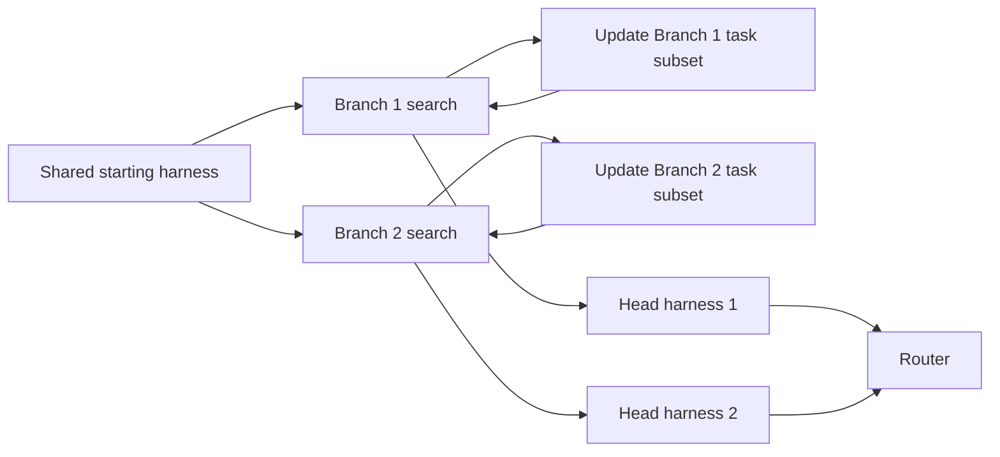

## Main idea
This method runs two harness-evolution branches in parallel. Each branch gradually claims the tasks where it has a relative advantage. The branches therefore specialize without human task labels. At deployment, a router chooses which final harness should handle a new input.

## Key concepts
- **Branch:** One independent harness-search process.
- **Frontier harnesses:** The best recent candidates inside a branch.
- **Ownership margin:** A branch claims a task only when its frontier solves it more reliably than other branches.
- **Proposal guidance:** Instructions that tell the proposer what kinds of changes have worked or failed.
- **Router:** A model or rule that chooses one specialist harness for a new task.

## Optimization loop

## How it works
1. Both branches start with the same harness and task set.
2. Each branch proposes and evaluates new whole-harness candidates.
3. The system compares how each branch's frontier performs on each development case.
4. A branch claims cases where it has a clear relative advantage.
5. Easy cases solved by every branch can be removed from active search.
6. Each branch also updates its own search guidance from local history.
7. At test time, a router selects one branch head for each task.

## Why it matters for RHEvolution
The useful idea is **adaptive allocation of search credit**. The paper finds that changing which cases each branch owns matters more than only changing the proposal prompt.

RHEvolution can use a similar ownership rule for components. A component should receive more budget when it explains or repairs a distinct failure group. But this paper still routes between whole harnesses. It never fuses their internal mechanisms.

## Evidence and limits
- The routed system improves over Meta-Harness in all four reported settings.
- The two branches develop visibly different strategies.
- Only two branches and one main proposer are studied.
- Routing preserves specialization, but it does not solve the hard problem of safe component fusion.
