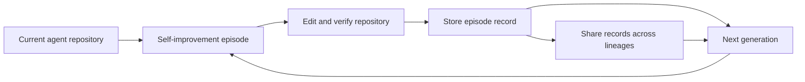

## Main idea
SelfSearch improves an agent without using downstream benchmark scores during search. Each generation studies records of earlier self-improvement attempts, changes its own repository, and passes those records to the next generation.

## Key concepts
- **Self-improvement episode:** One round in which the agent edits its own repository.
- **Episode record:** The reasoning, tool calls, results, and code changes from that round.
- **Lineage:** A sequence of descendants that evolve from one starting agent.
- **Reward-free search:** Search that does not use a downstream task score to choose each edit.
- **Cross-pollination:** Different lineages can learn from each other's records.

## Optimization loop

## How it works
1. The full agent repository is editable, but model weights stay fixed.
2. The agent reads records from earlier self-improvement rounds.
3. It edits tools, instructions, policies, or orchestration.
4. It verifies the repository locally.
5. The new agent performs the next self-improvement episode.
6. Two lineages evolve in parallel. One emphasizes capability. The other emphasizes adaptation.
7. Both lineages can read the previous records from both branches.
8. Downstream benchmarks are used only after checkpoints are frozen.

## Why it matters for RHEvolution
SelfSearch shows that the **improver itself can improve over time**. That is important because RHEvolution also changes a meta-level process, not only a task solver.

The missing part is decomposition. Each lineage still edits the full repository as one object. RHEvolution can add explicit component discovery, component budgets, and split/fuse decisions while keeping SelfSearch's useful episode-memory idea.

## Evidence and limits
- The paper reports gains across all six tested model-benchmark settings.
- It also reports cross-model transfer and lower search cost than evaluation-guided baselines in several settings.
- The search still uses local verification and human-written search directions.
- Only one realized evolutionary chain is reported per main setting, so stability across repeated searches is still unclear.
