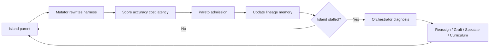

## Main idea
MILO evolves harnesses on several isolated search islands. It also evolves how the search is organized. When an island stalls, an orchestrator diagnoses the search problem and can change the mutator, combine lineages, create a new niche, or change the task curriculum.

## Key concepts
- **Island:** An independent population of related harness candidates.
- **Lineage memory:** A record of accepted and rejected mutations in that island.
- **Pareto frontier:** Candidates that are not worse on every objective, such as accuracy, tokens, and latency.
- **Stall:** A period with no useful progress.
- **Graft:** Combine useful material from two lineages.
- **Speciate:** Turn a distinct minority lineage into its own island.

## Optimization loop

## How it works
The inner loop evolves whole harnesses inside each island. Rejected mutations are kept as evidence, not discarded.

The outer loop watches search health. It classifies a stall as a weak mutator, an exhausted lineage, a suppressed niche, or a population-wide plateau. It then changes the search process. For example, it can assign a new mutator, graft two strong lineages, promote a niche to a new island, or focus training on high-regret tasks.

## Why it matters for RHEvolution
MILO is strong evidence that the **search strategy itself should adapt**. RHEvolution can use a similar meta-controller.

The major difference is the unit of evolution. MILO's islands contain whole harnesses. RHEvolution can make islands correspond to discovered components or subgraphs. Then the orchestrator can decide not only how to search, but also whether the decomposition itself should split or fuse.

## Evidence and limits
- The paper reports large gains on Terminal-Bench 2.1, PaperBench, and DeepSWE.
- The orchestrator gives the largest gain in the reported search-mechanism ablation.
- The stall diagnoses and intervention types are still human-defined.
- Preserving every island can waste budget on lineages that no longer have useful signal.
