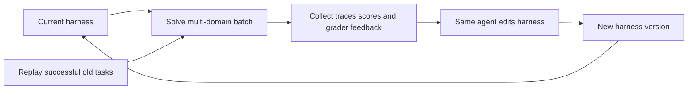

## Main idea
The same frozen model solves tasks and also edits the harness that it is running inside. The system starts from a very small harness and allows almost unrestricted repository edits. This removes many human-designed parts of the outer optimization loop.

## Key concepts
- **Same-model RSI:** The solver and the harness optimizer use the same model.
- **Same-harness RSI:** The optimizer runs inside the harness that it is changing.
- **Evolution batch:** A group of tasks used as the evidence for one update.
- **Evolution notes:** Persistent state that records what the optimizer learned from earlier rounds.
- **Replay anchor:** An older successful task that is replayed to reduce forgetting.

## Optimization loop

## How it works
1. A small seed harness runs a mixed batch from several benchmarks.
2. The full run records and grader outputs are saved.
3. The same model reads those records, the current code, and evolution notes.
4. It can create, delete, or rewrite harness files.
5. The new harness runs the next batch.
6. Later continual training adds tasks from a new domain and replays some older successes.

The paper compares this process to deep learning: source code acts like parameters, a task batch acts like a training batch, and the rewrite acts like an optimizer step.

## Why it matters for RHEvolution
This is a strong **monolithic RSI baseline**. It gives the agent broad edit freedom, but the search still produces one whole-harness successor per round.

The paper itself observes two problems that RHEvolution targets. First, edit diversity can collapse even when edit freedom is large. Second, acceptance has weak validation. RHEvolution can add explicit structural diversity, per-component budgets, and local-plus-global gates.

## Evidence and limits
- The reported harness improves on held-out in-distribution and out-of-distribution tasks.
- Useful mechanisms such as output truncation, time limits, compaction, and review emerge without a fixed edit list.
- The study reports one main stochastic evolution chain.
- Some benchmark results regress, which shows that unrestricted whole-harness edits can still create side effects.
