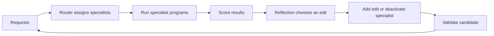

## Main idea
Adaptive-GEPA learns both the division of work and the specialist programs. It is not given task-family labels. During search, it can add specialists, change their roles, edit their code, change the router, or remove a specialist.

## Key concepts
- **Specialist:** A program that handles one learned region of the request space.
- **Router:** The component that sends each request to a specialist.
- **Role description:** A short description of what a specialist should handle.
- **Request overlap:** The set of requests that two specialists actually handle.
- **Branch merge:** Combine useful specialist libraries from different search branches.

## Optimization loop

## How it works
1. The system starts with a router and a specialist library.
2. A reflection model studies failures and recent search history.
3. It chooses one action: add a specialist, edit code, edit a role, edit the router, or deactivate a specialist.
4. A small batch checks the proposal before full validation.
5. Search branches can later merge.
6. Specialists from two branches are matched by the requests they actually handled, not by slot number or name.
7. A specialist's role description and code stay together during inheritance.

## Why it matters for RHEvolution
This is one of the closest papers to adaptive decomposition. The system learns a **task decomposition without task labels**, and the resulting specialist programs can evolve separately.

RHEvolution goes further in two ways. It can recursively split a failing component, not only add another top-level specialist. It can also assign separate search budgets to components. The request-overlap matching rule is especially useful for RHEvolution because component identity can change after a split or merge.

## Evidence and limits
- The paper reports a large gain over single-program GEPA on a four-family task mixture.
- The learned router exactly matches the post-hoc task partition on the reported test requests.
- The main result uses one seed and a fixed mixture of known task families.
- Search still uses one global call budget rather than independent budgets for each specialist.
