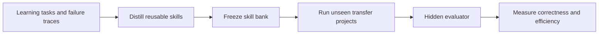

## Main idea
EngramBench is a benchmark for reusable skill learning. It tries to test whether a skill bank transfers an abstract capability instead of copying a solution from earlier tasks.

Its core rule is: **capability overlap without solution overlap**.

## Key concepts
- **Skill bank:** A frozen set of reusable procedures learned from earlier work.
- **Capability overlap:** Training and test tasks need some of the same general procedures.
- **Solution overlap:** Training and test tasks share code, APIs, schemas, or other details that can be copied.
- **Hidden evaluator:** Tests the agent cannot inspect during development.
- **CCPF:** The fraction of all applicable hidden test cases that the solution passes.

## Evaluation loop

## How it works
The benchmark has two strict phases.

1. The agent completes learning tasks and produces rich trajectories with mistakes and repairs.
2. A distillation process turns those traces into a skill bank.
3. The bank is frozen and hashed.
4. New transfer projects use different business logic and APIs.
5. The agent cannot access old workspaces or hidden tests.
6. A simulated user drives long development sessions.
7. Hidden evaluators score exact behavior, including concurrency, recovery, UI consistency, and operational compatibility.

## Why it matters for RHEvolution
RHEvolution needs a benchmark that can tell the difference between **good decomposition** and **memorized fixes**. EngramBench offers useful transfer discipline and fine-grained requirement scores.

Its main limitation for RHEvolution is that the skill bank is frozen during transfer. A truly adaptive decomposition system changes structure online. Therefore RHEvolution should borrow the anti-leakage protocol but add a separate dynamic-evolution evaluation.

## Evidence and limits
- The reported skill banks give modest correctness gains but very large reductions in coding time and token use.
- Less historical text can still produce a strong skill bank, which suggests abstraction quality matters more than raw memory size.
- The detailed ablation uses only part of the full transfer suite.
- Results depend on one main coding-model and simulated-user pairing.
