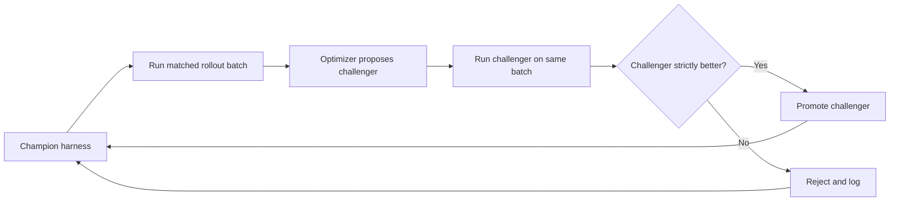

## Main idea
This paper shows that harness evolution can fail for a simple statistical reason: promotion decisions are too noisy. Larger matched rollout batches and a strict Champion-Challenger gate make evolution much more reliable.

## Key concepts
- **Champion:** The current accepted harness.
- **Challenger:** A proposed new harness.
- **Matched cases:** The champion and challenger run on the same task and seed set.
- **Promotion gate:** The challenger replaces the champion only if measured performance is better.
- **Rollout scale:** The number of task executions used to make one promotion decision.

## Optimization loop

## How it works
1. The champion runs on a fixed training sample.
2. The optimizer reads complete trajectory evidence and recent rejected changes.
3. It proposes one bounded harness commit.
4. Repository tests run first.
5. The challenger runs on the same task and seed cases.
6. With Champion-Challenger selection, only a strict win is promoted.
7. Rejected changes stay in the log so the optimizer can avoid repeating them.

The paper compares this with unconditional acceptance, where every valid edit becomes the new base.

## Why it matters for RHEvolution
This is a key design constraint for split and fuse decisions. A decomposition change is a **compounding structural decision**. If the evidence is noisy, one bad decision changes the search space for all later rounds.

RHEvolution should therefore use enough evidence before changing structure. It should also place the strict gate at the full-harness level. A local component can get worse while the complete system gets better, so local scores alone must not control promotion.

## Evidence and limits
- The largest rollout batch gives the strongest held-out result in the reported study.
- Unconditional acceptance drifts downward, while Champion-Challenger search improves monotonically on its training sample.
- Small batches produce many ties and misleading promotions.
- The best tested batch is still the largest one, so the required sample size may be even higher in harder domains.
