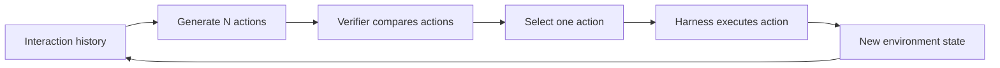

## Main idea
Mid-Harness adds compute before an action reaches the environment. The model proposes several possible actions. A verifier selects one. Only the selected action is sent to the normal harness.

## Key concepts
- **Action scaling:** Spend extra compute to compare several possible next actions.
- **Generator:** The model that proposes actions.
- **Verifier:** The component that chooses which proposed action should execute.
- **Listwise verification:** Compare all candidates in one call.
- **Pointwise verification:** Score each candidate separately.
- **Pairwise verification:** Compare candidates two at a time.

## Optimization loop

## How it works
At each agent step:
1. The generator samples several possible actions.
2. The verifier sees the history and candidate set.
3. It selects one candidate.
4. The existing harness executes only that action.
5. The process repeats at the next step.

The paper also trains a smaller verifier to imitate a stronger frontier verifier. The generator itself stays unchanged.

## Why it matters for RHEvolution
Mid-Harness is not a decomposition method, but it isolates **verification as its own component**. This is useful for RHEvolution because the selector that judges split, fuse, or revert decisions is also a component that can fail.

The paper's main lesson is general: diversity is not enough. If the selector is weak, more candidates add little value. RHEvolution therefore needs to measure selector quality separately from proposal quality.

## Evidence and limits
- A strong verifier gets large gains from the same fixed generator.
- Pairwise verification works best among the tested mechanisms, but it is expensive.
- A distilled verifier closes part of the gap to the frontier verifier.
- There are no gold labels for the best next action, so verifier quality is measured indirectly.
