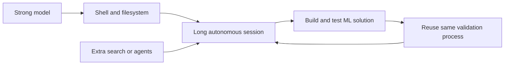

## Main idea
This paper tests whether complex harness machinery still helps a strong coding agent. Under matched compute and hardware, the largest gain comes from giving the model a shell and filesystem. Extra search trees and simple multi-agent orchestration do not show a clear additional benefit.

## Key concepts
- **Matched budget:** Systems get the same time, hardware, and model so the harness is the main changing factor.
- **Coding-agent environment:** Direct access to shell, files, and execution feedback.
- **Search primitive:** A fixed outer search method such as greedy search, UCB, or Best-of-N.
- **Selection gap:** The difference between the best candidate that exists and the candidate the system actually chooses.
- **Malena:** The paper's minimal long-running single-session agent.

## Evaluation loop

## How it works
The authors hold the backbone, hardware, and 24-hour budget fixed. They add harness machinery step by step: coding tools, search strategies, autonomy, then multi-agent variants.

They also compare the simple Malena agent with several released MLE harnesses across several backbones.

## Why it matters for RHEvolution
This is an important **null baseline**. RHEvolution should not assume that more structure is automatically better.

A strong model can already create its own local decomposition while it works. Therefore an explicit adaptive-decomposition system must show one of two things: better task performance at the same budget, or similar performance with less search cost. Otherwise the structure is unnecessary overhead.

This paper also suggests that harness value can depend on model strength. Weaker models may benefit more from explicit structure than frontier models.

## Evidence and limits
- The coding-agent environment is the largest intervention in the reported study.
- No tested search strategy has a statistically clear advantage over the others.
- Simple multi-agent variants also do not show a clear gain.
- The study is concentrated on autonomous ML engineering, so the result may not transfer to harness evolution itself.
