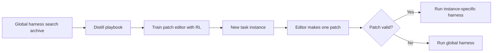

## Main idea
Turbo Harness starts with one strong global harness, then creates one small task-specific patch for each new instance. It learns how to make these patches from the search history that a normal global harness optimizer would usually throw away.

## Key concepts
- **Global harness:** One harness chosen for the whole task distribution.
- **Search exhaust:** Old candidate harnesses, traces, failures, and reflections from completed search.
- **Playbook:** A compact summary of editing strategies and the conditions where they helped or failed.
- **Editor model:** A model trained to produce one harness patch for a new task.
- **Fallback:** Use the global harness when the patch cannot be applied safely.

## Optimization loop

## How it works
1. A normal harness optimizer first produces a strong global harness and a large archive.
2. The archive is summarized into a playbook of good and bad edit strategies.
3. During training, an editor proposes several patches for each instance.
4. The patches are evaluated, and reinforcement learning trains the editor from the relative rewards.
5. At inference time, one editor call produces one patch.
6. The task runs once with the patched harness. If the patch is invalid, the system falls back to the global harness.

## Why it matters for RHEvolution
Turbo Harness supports the claim that **one harness does not fit every case**. However, it adapts at the task-instance level, not the component level.

RHEvolution can reuse the playbook idea. Component search will also produce a large amount of rejected and accepted edit history. That history can become a component-specific editing policy instead of being discarded.

## Evidence and limits
- The paper reports gains over Meta-Harness across several agent benchmarks.
- The combined playbook plus RL editor matters more than either part alone.
- Gains are smaller when the global harness already captures most of the available headroom.
- Training the editor needs extra environment rollouts.
