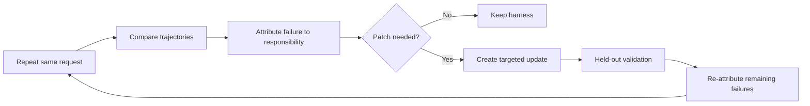

## Main idea
EvoGen-Harness improves several parts of an image-generation harness instead of optimizing only one fixed part. Its main tool is failure attribution across repeated stochastic runs. The system first decides which harness responsibility is likely at fault, then focuses search there.

## Key concepts
- **Responsibility:** A harness function such as prompting, routing, workflow control, or tool use.
- **Stochastic execution:** Repeating the same request can produce different results.
- **Trajectory-relative attribution:** Compare repeated executions to decide which responsibility is linked to the failure.
- **No-Patch decision:** Decide that the harness should not change.
- **Regression check:** Test whether a patch damages previously good behavior.

## Optimization loop

## How it works
1. The system runs the same request several times.
2. It compares the executions instead of trusting one result.
3. It estimates which harness responsibility caused the persistent failure.
4. That attribution becomes a search prior.
5. The optimizer changes the selected responsibility.
6. Held-out tests and regression checks decide whether to keep the update.
7. Remaining failures are attributed again because the important bottleneck can move after a fix.

## Why it matters for RHEvolution
This paper directly addresses RHEvolution's **credit-assignment problem**. Repeated rollouts can separate a stable component failure from random execution noise.

The No-Patch metric is also important. A good meta-controller must know when the current decomposition is not the problem.

The remaining gap is that the responsibility list is fixed. RHEvolution can use the same attribution process, then create or merge responsibilities when the current list cannot explain the evidence.

## Evidence and limits
- The paper reports gains over single-dimension harness baselines on three image-generation benchmarks.
- Attribution recall is high but not perfect.
- No-Patch accuracy is reported as 94.8%, with a low regression rate.
- All evidence comes from text-to-image systems, so transfer to long-horizon agents is still open.
