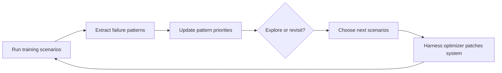

## Main idea
ActiveSaddler changes which training scenarios the harness optimizer sees. It groups failures into learned failure patterns, estimates which patterns still have useful learning signal, and chooses whether to revisit them or explore new scenarios.

## Key concepts
- **Curriculum:** The order and mix of training scenarios.
- **Failure-pattern arm:** A learned group of failures that appear to come from the same harness weakness.
- **Bandit:** A decision process that balances known useful choices with exploration of unknown choices.
- **Learning progress:** An estimate of how much more improvement a failure pattern can still produce.
- **Exploration:** Spend budget on unseen scenarios to discover new weaknesses.

## Optimization loop

## How it works
1. Failed traces are converted into failure-pattern arms.
2. New arms can appear as new weaknesses are discovered.
3. Each arm gets a priority based on expected future learning progress.
4. The controller decides whether to revisit a known arm or explore unseen tasks.
5. The chosen scenarios feed the underlying harness optimizer.
6. New results update both the harness and the curriculum.

## Why it matters for RHEvolution
ActiveSaddler gives RHEvolution a strong answer to **where the next unit of search budget should go**.

Its ablations are especially relevant. Coarse failure categories lose useful signal, but treating every scenario as its own arm is too fragmented. This supports the idea that the right granularity must be discovered.

RHEvolution can apply the same logic to components: create, merge, or split components so each search unit has enough shared signal without becoming too broad.

## Evidence and limits
- The paper reports gains over fixed-order AutoSaddler on GAIA2 and Terminal-Bench 2.0.
- The curriculum also improves GEPA, which suggests the scheduling idea is not tied to one optimizer.
- Arm granularity is important in the ablations.
- The system adapts the data curriculum, not the harness decomposition itself.
