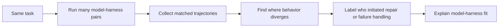

## Main idea
This study shows that there is no single best harness independent of the model and task. Model rankings can reverse when only the harness changes. The important variable is the **model-harness fit**.

## Key concepts
- **Configuration:** One model paired with one harness.
- **Ranking reversal:** Model A beats Model B under one harness, but loses under another.
- **Matched trajectory:** The same task run under different configurations.
- **Initiator:** The source of an action or repair: the model itself, a harness message, or the harness acting directly.
- **Failure handoff:** How the harness reports a failed action back to the model.

## Analysis loop

## How it works
The study runs several models across several configurable harnesses and benchmarks. It then compares matched trajectories to find why two configurations with similar starting behavior end differently.

A major factor is how the harness returns errors. Some models work well with a lean scaffold. Other models need forgiving tool-call handling or stronger recovery logic.

The paper also labels whether a useful recovery came from the model, from a harness message, or from a harness-performed action.

## Why it matters for RHEvolution
RHEvolution should not learn one universal decomposition and assume it transfers everywhere. The useful component boundary can depend on the **model under the harness**.

The initiator label is also a useful credit signal. If the harness hides a failure from the model, the problem is different from a case where the model receives clear feedback and still fails. RHEvolution can use this signal when deciding whether to split a harness component or leave the problem to the model.

## Evidence and limits
- The paper reports large ranking reversals across harnesses.
- A model's own vendor harness is not always its best harness.
- The study covers many configurations and releases a common trajectory format.
- The benchmarks are mainly terminal and coding-agent tasks, so broader domains still need testing.
