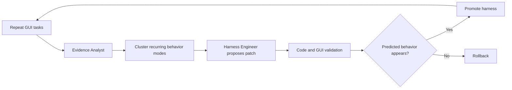

## Main idea
GUI-HARVEST improves a GUI-agent harness from visual execution evidence. It repeats tasks, finds the decisive failed step, groups similar failures into learned behavior modes, creates a bounded patch, and checks whether the predicted behavior change actually happened.

## Key concepts
- **Visual evidence:** Before-and-after screenshots linked to actions.
- **Repeated rollout:** Run the same task several times from a clean state.
- **Behavior mode:** A recurring failure mechanism discovered across tasks.
- **Pre-registered update plan:** The engineer records the intended change and predicted effect before evaluation.
- **Behavioral validation:** Check whether the candidate changed the behavior it claimed it would change.

## Optimization loop

## How it works
1. Each task runs several times from clean snapshots.
2. The analyst aligns actions with screenshots and identifies the decisive failure.
3. A deterministic check confirms that findings cite real evidence.
4. The clusterer groups verified findings into open-vocabulary behavior modes.
5. The engineer links a selected mode to source code and predicts an observable effect.
6. The validator runs code checks, GUI tests, and behavior checks.
7. Candidates are promoted or rolled back. The result is stored in an update ledger.

## Why it matters for RHEvolution
GUI-HARVEST gives RHEvolution two strong primitives.

First, the behavior modes are a **discovered decomposition of failure space**. Second, the pre-registered behavioral prediction makes credit assignment harder to fake after the result is known.

RHEvolution can extend this by mapping a discovered failure mode to a mutable harness component and changing the component graph when the existing mapping is poor.

## Evidence and limits
- The method improves all six frozen backbones in the reported OSWorld-Verified study.
- Removing visual evidence or the cross-task clusterer causes large drops.
- Repeated rollouts are important for reliable diagnosis.
- The engineer still edits a fixed runtime surface. Full structural redesign is outside the method.
