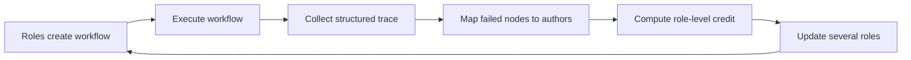

## Main idea
FloWright gives separate learning credit to different roles inside a workflow. Instead of using only one final score for the complete workflow, it maps failed trace nodes back to the role that authored them. This lets several coupled roles improve together.

## Key concepts
- **Workflow:** A graph or sequence of roles and operations that solve a task.
- **Sparse reward:** One final score that gives little information about where the failure came from.
- **Role-level credit:** Assign part of the failure signal to the role responsible for specific trace nodes.
- **Co-evolution:** Update several interacting roles during the same training process.
- **Authorship:** Which role created the node or decision that later failed.

## Optimization loop

## How it works
1. Several roles build and execute a workflow.
2. The system records which role authored each important trace node.
3. The final outcome is broken into more local signals.
4. A role receives credit or blame mainly for its own authored nodes.
5. Several roles can then train together instead of only one role changing.

The paper also introduces harder workflow-level training data so the system cannot solve every case with a single agent.

## Why it matters for RHEvolution
This is a direct lesson for split decisions. If a composite harness fails, the final score does not identify the responsible component.

Authorship-based trace credit is one possible signal. RHEvolution can attach ownership metadata to nodes in its execution trace. When a failure occurs, the meta-controller can ask which component produced the bad subtrace.

However, simple authorship can still be wrong when an upstream component sends bad information to a downstream component. RHEvolution needs causal checks for these cascades.

## Evidence and limits
- Co-evolving roles outperform single-role optimization in the reported experiments.
- The method does not need extra evaluator models for credit assignment.
- Credit depends on an instrumented trace with reliable node ownership.
- Cascading failures can make ownership-based blame inaccurate.
