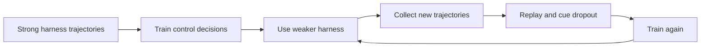

## Main idea
Harness Annealing moves control knowledge from the harness into the model. The model first learns from trajectories produced with strong external support. Training then uses progressively weaker harnesses so the model learns to perform more of the control work itself.

## Key concepts
- **Control responsibility:** A decision such as what to inspect, whether to revise, or when to stop.
- **Layered supervision:** Train different control decisions as separate types instead of treating the full trajectory as one flat sequence.
- **Annealing:** Gradually reduce external support during training.
- **Cue dropout:** Remove some harness cues so the model cannot depend on them completely.
- **Replay:** Mix older training examples into later stages to reduce forgetting.

## Training loop

## How it works
1. Training begins with trajectories produced under a strong harness.
2. The trajectory is segmented by control role, such as investigate, revise, and stop.
3. The model is trained directly on those control decisions.
4. Later training uses weaker harnesses.
5. Replay and cue dropout reduce dependence on external support.
6. The final model is tested under several harness strengths.

## Why it matters for RHEvolution
This paper changes the question from “How should the harness be decomposed?” to “Should this responsibility still live in the harness at all?”

That is important. A stable component that the model can reliably internalize may be removable. RHEvolution could treat **move responsibility into the model** as a future operator, alongside split and fuse.

The caution is that this requires model training. If RHEvolution keeps model weights frozen, it can only optimize the external side of the boundary.

## Evidence and limits
- Annealed models reduce dependence on the full harness in the reported software-QA tasks.
- Layered supervision transfers better to weak-harness deployment than direct trajectory SFT in the reported comparison.
- The study uses two related model sizes and one main harness hierarchy.
- Training budgets are not perfectly matched across all comparisons.
