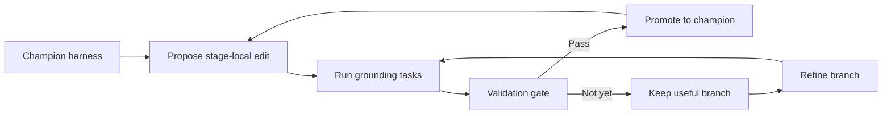

## Main idea
VideoEvolve keeps the main stage boundaries of a video-grounding harness fixed, but lets the code and instructions inside each stage evolve. It also keeps promising non-champion branches alive, so a candidate can continue improving even when it is not ready to replace the current best harness.

## Key concepts
- **Cloze-structured harness:** Stage interfaces are fixed, but the content inside each stage is an editable blank.
- **Stage interface:** The required input and output format between two harness stages.
- **Champion:** The current accepted harness.
- **Retained branch:** A non-champion candidate that can still receive later edits.
- **Promotion gate:** A test that decides whether a candidate replaces the champion.

## Optimization loop

## How it works
The harness uses stages such as Observe, Propose, Cross-check, Arbitrate, Budget gate, and Finalize. Their interfaces stay fixed.

An external coding agent edits code or instructions inside these stages. Execution feedback guides the next edit. A candidate that does not beat the champion can still remain as a retained branch if it has useful structure. Later edits can continue from that branch instead of always starting from the champion.

## Why it matters for RHEvolution
VideoEvolve gives a useful middle point between fixed modules and fully adaptive decomposition. Stable interfaces reduce integration risk, while internal search remains flexible.

RHEvolution can copy this idea when it splits a component. The split should create explicit interfaces, and those interfaces should remain stable long enough to measure whether the new structure helps.

The retained-branch idea is also important. A structural split can be promising before it is immediately better. Deleting it after one weak result can cause premature convergence.

## Evidence and limits
- The paper reports gains on ReXTime and TimeLens-Bench.
- Evolved instructions help consistently, while code changes help less consistently.
- Search cost is high.
- The decomposition boundaries are designed by humans rather than discovered by the optimizer.
