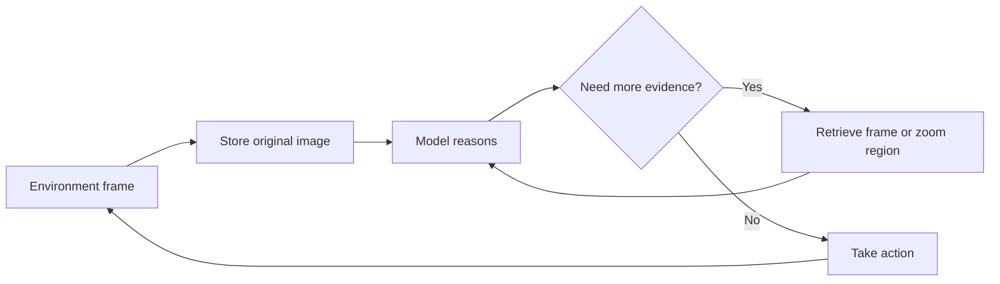

## Main idea
VISTA improves interactive visual reasoning by preserving raw visual evidence. Instead of compressing every observation into text, the harness stores original frames and lets the model retrieve and inspect the visual regions it needs.

## Key concepts
- **Lossless visual memory:** Store original frames without summarizing away visual detail.
- **Active inspection:** The model chooses which old frame or image region to inspect.
- **Observation channel:** The form in which environment state reaches the model.
- **Context compaction:** Shorten old text when the conversation becomes too long.
- **Revisable notes:** Small persistent files where the agent keeps its current understanding.

## Reasoning loop

## How it works
1. The environment returns rendered images.
2. The harness stores every important frame in original form.
3. The model can request an enlarged crop or revisit an older frame.
4. The harness avoids flooding the context with every image automatically.
5. Text context can be compacted, while the visual archive stays available.
6. Persistent notes store the agent's current model of the environment.

## Why it matters for RHEvolution
VISTA is not a harness optimizer, but it gives a major credit-assignment lesson: **do not destroy the evidence before diagnosis**.

RHEvolution will depend on execution traces to decide which component failed. If those traces are aggressively summarized, the meta-controller can lose the detail needed to make a correct split or fuse decision.

The ablation style is also useful. VISTA measures the marginal effect of separate harness components, which is the same evidence RHEvolution needs before changing structure.

## Evidence and limits
- The paper reports very large gains on ARC-AGI-3 with the visual harness.
- Lossless memory and active inspection are major contributors in the harness ladder.
- Public benchmark contamination cannot be ruled out because the tested models were released after the public games.
- The strongest evidence is still from visual games and puzzles rather than general real-world GUI or robot tasks.
